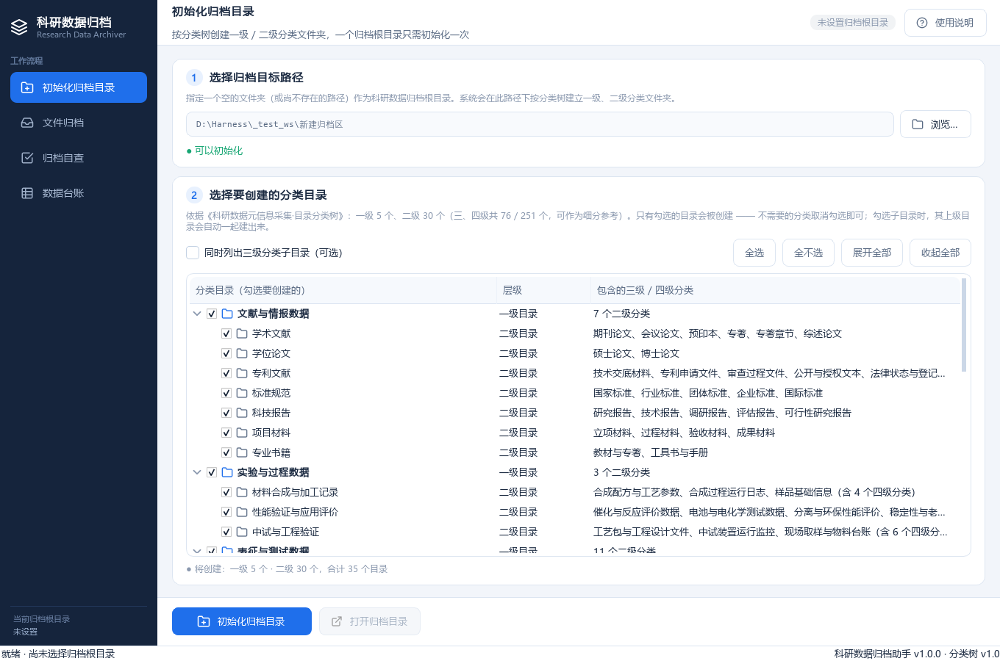
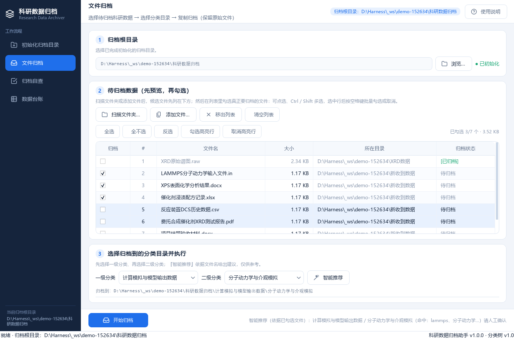
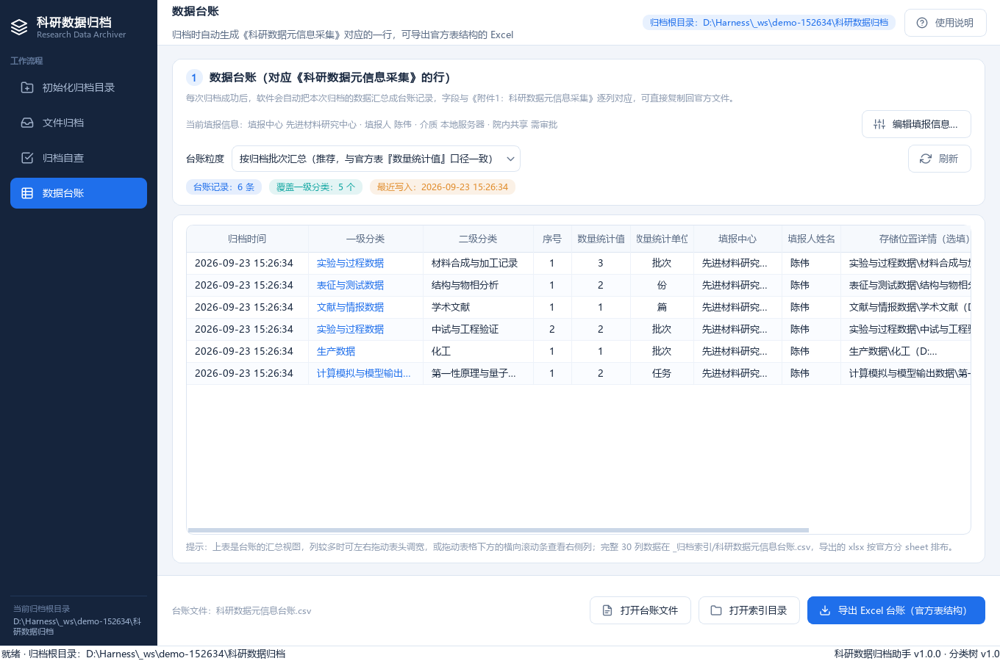

# 科研数据归档助手

面向科研数据管理的桌面工具：按官方分类树把散落的科研数据**规范化归档**，
自动生成**《科研数据元信息采集》台账**，并支持**抽样自查**与**问题清单导出**。

Windows 与 macOS 均可运行；提供 Windows 单文件 exe 与 macOS `.app` / `.dmg` 的构建脚本。

---

## 功能

工具按四个页面串成一条工作流：

| 页面 | 做什么 |
|---|---|
| **① 初始化归档目录** | 选一个空目录作为归档根，在分类树里**勾选要创建的分类**——一级 / 二级 / 三级都能只挑一部分，不勾的不会建出来；勾了子目录会自动带上其父目录。支持「全选 / 全不选」、实时显示"将创建 一级 x 个 · 二级 y 个 · 合计 n 个"，需要补建时再勾上点『补齐勾选的分类目录』，已建目录与已有数据不受影响。同时写入《归档说明.md》（只列实际创建的目录）与归档索引 |
| **② 文件归档** | 扫描文件夹或拖入文件 → 在列表里勾选 → 选一级/二级分类 → 复制归档。**不删除原始文件**；已归档的文件显示 `[已归档]` 且不可再勾选，**不会重复复制**；目标目录已有同名同大小文件时按已归档直接跳过 |
| **③ 归档自查** | 检查范围可精确到**任意一级子文件夹**；支持「全部文件」或「按二级分类随机抽样」，**抽样比例、每类保底数、每类封顶数都由用户自定**；勾选问题文件后一键导出 CSV 清单 |
| **④ 数据台账** | 每次归档后**自动生成《科研数据元信息采集》里对应的一行**，可导出**列序与官方文件完全一致**的 xlsx，直接复制粘贴回官方表。表格 10 列保证可读宽度，放不下时底部有**横向滚动条**，也可拖动表头调宽 |

> **表格列宽规则**：列少的表按比例**铺满窗口**（拖宽一列，其余自动让位，右侧不留白）；
> 列多的表（数据台账 10 列）**不会把列压到读不清**——放不下时出现横向滚动条，滚动即可看全。

### 界面

| 初始化归档目录 | 文件归档 |
|---|---|
|  |  |

| 归档自查 | 数据台账 |
|---|---|
|  |  |

---

## 直接运行（源码）

```bash
pip install -r requirements.txt
python app.py
```

macOS 用户可直接双击 `mac/run_on_mac.command`（首次会自动建虚拟环境并装依赖）。

## 打包

### Windows → 单文件 exe

```bash
python build.py
# 产物：dist/科研数据归档助手.exe
```

### macOS → .app / .dmg

**必须在 macOS 上执行**（PyInstaller 不是交叉编译器，Windows/Linux 无法产出 macOS 二进制）：

```bash
bash mac/build_mac.sh
# 产物：dist-mac/科研数据归档助手.app
#       dist-mac/科研数据归档助手.dmg
```

可选环境变量：`ARCH=arm64|universal2`、`SKIP_DMG=1`（只出 .app）、`PYTHON=/usr/bin/python3`。

### 没有 Mac，怎么拿 macOS 安装包？

用仓库里现成的 GitHub Actions 工作流 `.github/workflows/build-macos.yml`：

1. 把本仓库推到 GitHub；
2. 打开仓库的 **Actions** 页面 → 选「**构建 macOS 安装包**」→ **Run workflow**；
3. 跑完后在该次运行页面底部下载 artifact：
   - `rdarchiver-macos-arm64`（Apple Silicon 的 .dmg 与 .zip）
   - `rdarchiver-macos-x86_64`（Intel 的 .dmg 与 .zip）

打一个 `v*` 形式的标签（如 `v1.1.0`）再推送，还会**自动创建 Release** 并把安装包附上去。

> 关于 runner 标签：`macos-13` 已于 2025-12-04 完全退役、`macos-14` 于 2026-11-02 EOL，
> 因此工作流使用 `macos-15`(arm64) 与 `macos-15-intel`(x86_64)。

### 首次打开 macOS 版被拦下？

未签名的应用会被 Gatekeeper 拦截，任选一种：

```bash
# A. 右键点图标 → 打开 → 再点“打开”（只需一次）
# B. 终端执行：
xattr -dr com.apple.quarantine "/Applications/科研数据归档助手.app"
```

正式对外分发需要 Apple 开发者账号做 `codesign` + `notarize`。

---

## 归档区结构

初始化后在归档根目录下生成：

```
归档根目录/
├── 文献与情报数据/            ← 5 个一级分类
│   ├── 学术文献/              ← 30 个二级分类
│   └── ...
├── 实验与过程数据/
├── 表征与测试数据/
├── 计算模拟与模型输出数据/
├── 生产数据/
├── 归档说明.md                ← 自动生成，含分类树与使用说明
└── _归档索引/                 ← 软件的数据目录，请勿手工改动
    ├── manifest.json          ← 已归档文件索引 + 台账填报配置
    ├── 归档日志.csv            ← 每次归档的追溯记录
    └── 科研数据元信息台账.csv    ← 台账号（导出 xlsx 的源）
```

分类名中的 `/` 等 Windows 非法字符会替换为全角字符（如 `粒度/颗粒/粉末分析` → `粒度／颗粒／粉末分析`），
**以保证 Windows 与 macOS 归档出的目录名完全一致**，同一份数据可跨平台流转。

---

## 推送前自检

改完代码准备推送前，建议先跑一遍：

```bash
python mac/preflight.py
```

它会检查那些「本机不暴露、到 CI 才炸」的问题：`.gitignore` 是否挡住构建产物、
shell 脚本换行符是否为 LF（Windows 的 `core.autocrlf` 会造成 CRLF 而让 mac 端报
`\r: command not found`）、工作流 runner 标签是否仍可用、依赖是否齐全等。

---

## 依赖

- Python 3.10+
- PySide6（界面）
- openpyxl（台账导出 xlsx，**漏装会导致该功能不可用**）
- PyInstaller（仅打包时需要）
